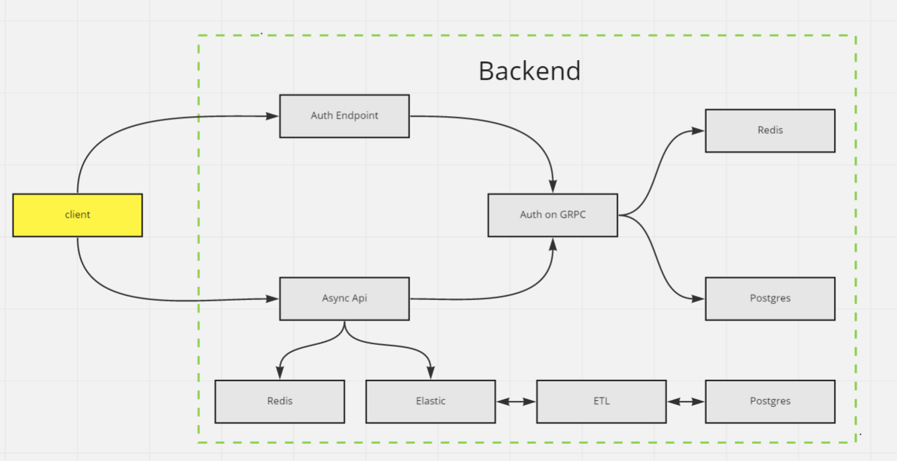

# Модуль Auth

### Swagger schema:
https://app.swaggerhub.com/apis/seleswagger/PRACTIX/1.0.0#/


### Схема сервисов



Оба сервиса доступны в локальном swagger'e

* **Auth**: http://localhost:5000/api/v1
* **AsyncApi**: http://localhost:8000/docs


## Настройка

Для корректного запуска проекта необходимо произвести ряд действий.
1. Создать к корне проекта папки .es-data, .pg-data, и выдать на них права:

        $ mkdir .es-data .pg-data \
        && chmod g+rwx .es-data .pg-data \
        && chgrp 1000 .es-data .pg-data


## Запуск 


Для запуска контейнеров в корне проекта выполняем:

Модуль **Async API** (FastApi):
    
    sudo docker-compose -f docker-compose-async_api.yml up -d --build

Модуль **Auth**:

    sudo docker-compose -f docker-compose-auth.yml up -d --build

Всё вместе:

    sudo docker-compose -f docker-compose-async_api.yml -f docker-compose-auth.yml up -d --build

авторизоваться из под админа можно так:
- login: admin
- password: 1

## Тесты

Для запуска тестов локально, потребуется добавить локальные переменные:

```
export ELASTIC_HOST=localhost:9200
export FASTAPI_HOST=http://localhost:8000
export REDIS_HOST=localhost
export REDIS_PORT=6379
export AUTH_HOST=http://localhost:5000
export AUTH_REDIS_HOST=localhost
export AUTH_REDIS_PORT=6380
```

А так же установить все необходимые библиотеки на локальную машину:

```
pip install -r tests/functional/requirements.txt
```

Больше информации [тут](./tests/functional/README.md)